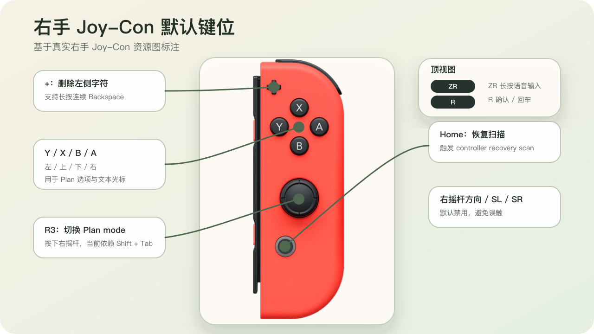
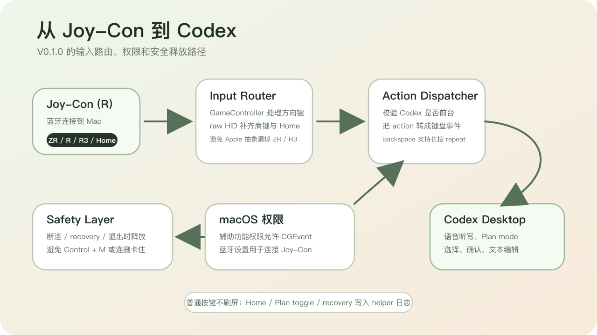
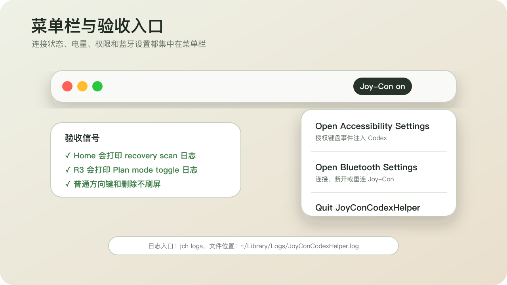

# JoyCon Codex Helper

把右手 Joy-Con 变成 Codex Desktop 的轻量语音与编辑控制器。

> 当前版本：`v0.1.0`
> 项目面向 macOS + Codex Desktop + `Joy-Con (R)` 工作流，不隶属于 Nintendo、OpenAI 或 Apple。



## 中文 README

### 概述

`JoyCon Codex Helper` 是一个 macOS 菜单栏小工具，让你用右手 Joy-Con 操作 Codex Desktop 的常用输入动作。

它当前聚焦这类工作流：

- 按住 `ZR` 触发 Codex 语音听写快捷键 `Control + M`，松开后停止。
- 用 `X / B / Y / A` 做上下左右选择，既可用于 Plan 选项，也可用于文本光标移动。
- 用 `+` 执行 `Backspace`，支持长按连续删除。
- 用 `R` 执行 `Return`。
- 用 `R3` 尝试切换 Plan mode。
- 用 `Home` 触发一次控制器恢复扫描。
- 菜单栏只展示连接状态：`Joy-Con on` 或 `Joy-Con offline`。



### 默认键位

| Joy-Con 按键 | 默认动作 |
| --- | --- |
| `ZR` 长按 | `Control + M`，用于 Codex 语音听写 |
| `X` / `B` | 上 / 下 |
| `Y` / `A` | 左 / 右 |
| `R` | `Return` |
| `+` | `Backspace`，支持长按连续删除 |
| `R3` | 尝试切换 Plan mode |
| `Home` | 触发 controller recovery scan |
| 右摇杆方向 | 默认禁用 |
| `SL` / `SR` | 默认禁用 |

### 安装与运行

前置条件：

- macOS 14 或更新版本
- 已安装 Xcode Command Line Tools，且 `swift` 可用
- 右手 `Joy-Con (R)` 已通过蓝牙连接到 Mac
- 已安装 Codex Desktop

从源码运行：

```bash
git clone https://github.com/cyjjjj-21/joycon-codex-helper.git
cd joycon-codex-helper
swift run JoyConCodexHelper
```

安装短命令 `jch`：

```bash
mkdir -p ~/.local/bin
ln -sf "$(pwd)/bin/jch" ~/.local/bin/jch
jch
```

查看实时日志：

```bash
jch logs
```

### 第一次试用

1. 在 macOS 蓝牙设置中连接右手 `Joy-Con (R)`。
2. 启动 helper：`jch` 或 `swift run JoyConCodexHelper`。
3. 打开 Codex Desktop，并把焦点放进 composer 或 Plan 选项区域。
4. 如果按键没有进入 Codex，先点菜单中的 `Open Accessibility Settings`，给 Terminal 或 helper 进程开启辅助功能权限。
5. 如果 Joy-Con 连接异常，点 `Open Bluetooth Settings` 检查蓝牙连接。
6. 按住 `ZR` 说话，松开停止听写。



### 菜单栏

菜单栏现在只显示连接状态，不再显示电量百分比。

- `Joy-Con offline`：当前没有识别到控制器。
- `Joy-Con on`：已识别到控制器并完成接管。

菜单项：

- `Open Accessibility Settings`
- `Open Bluetooth Settings`
- `Quit JoyConCodexHelper`

### 设计说明

macOS 的 `GameController` 框架在部分 Joy-Con 状态下不会暴露 `ZR`、`R`、`R3` 和 `Home`。因此本项目采用双路径：

- 普通方向与常规按钮继续走 `GameController`
- 漏掉的关键按键额外走 raw HID

按键注入通过 `CGEvent` 完成。组合键长按遵循标准时序：

```text
modifier down -> key down -> key up -> modifier up
```

helper 会在控制器断连、恢复扫描和应用退出时释放 held keys，避免 `Control + M` 或连续删除卡住。

### 配置

主要配置文件：

- `config/profiles/layout-v1-default.json`
  物理按键到 action 的映射
- `config/bindings/default-actions.json`
  action 到键盘事件的映射
- `config/runtime/input-aliases.json`
  `GameController` 与 raw HID 的运行时 alias
- `config/runtime/controller-preferences.json`
  控制器选择与运行时偏好
- `config/runtime/target-apps.json`
  目标应用 bundle id

如果想改键位，优先改配置文件，而不是改底层路由代码。

### 已知边界

- 编辑键只校验 Codex 是否在前台，不做深度 composer 焦点检测。
- `R3` 当前依赖 Codex Desktop 的 `Shift + Tab` 行为来尝试切换 Plan mode。
- `Home` 不是“从完全睡眠中唤醒 Joy-Con”的魔法按钮。它是在 helper 已收到 `Home` 事件时触发一次恢复扫描。
- 本项目当前只针对右手 `Joy-Con (R)` 设计。

### 开发

运行测试：

```bash
swift test
```

本地启动：

```bash
swift run JoyConCodexHelper
```

### 图片说明

README 中的键位图、工作流图和菜单栏图用于说明默认交互，不属于 helper 的运行时资源。

素材来源与说明见 [docs/assets/ATTRIBUTION.md](docs/assets/ATTRIBUTION.md)。

### 许可

项目源代码采用 MIT License，见 [LICENSE](LICENSE)。

外部图片素材及其派生图按对应素材授权执行。

---

## English README


### Overview

`JoyCon Codex Helper` is a macOS menu bar utility that lets you drive common Codex Desktop actions with a right Joy-Con.

It currently focuses on this workflow:

- Hold `ZR` to trigger Codex dictation via `Control + M`, and release to stop.
- Use `X / B / Y / A` for up/down/left/right navigation in Plan options or text cursor movement.
- Use `+` as `Backspace`, including press-and-hold repeat.
- Use `R` as `Return`.
- Use `R3` to attempt a Plan mode toggle.
- Use `Home` to trigger a controller recovery scan.
- The menu bar shows connection state only: `Joy-Con on` or `Joy-Con offline`.


### Default Mapping

| Joy-Con button | Default action |
| --- | --- |
| `ZR` hold | Hold `Control + M` for Codex dictation |
| `X` / `B` | Up / Down |
| `Y` / `A` | Left / Right |
| `R` | `Return` |
| `+` | `Backspace` with repeat while held |
| `R3` | Attempt Plan mode toggle |
| `Home` | Trigger controller recovery scan |
| Right stick directions | Disabled by default |
| `SL` / `SR` | Disabled by default |

### Install and Run

Requirements:

- macOS 14 or newer
- Xcode Command Line Tools with `swift`
- A right `Joy-Con (R)` paired to your Mac over Bluetooth
- Codex Desktop installed

Run from source:

```bash
git clone https://github.com/cyjjjj-21/joycon-codex-helper.git
cd joycon-codex-helper
swift run JoyConCodexHelper
```

Optional short command `jch`:

```bash
mkdir -p ~/.local/bin
ln -sf "$(pwd)/bin/jch" ~/.local/bin/jch
jch
```

Tail live logs:

```bash
jch logs
```

### First Run

1. Pair the right `Joy-Con (R)` in macOS Bluetooth settings.
2. Launch the helper with `jch` or `swift run JoyConCodexHelper`.
3. Open Codex Desktop and put focus in the composer or a Plan option area.
4. If input does not reach Codex, use `Open Accessibility Settings` and grant Accessibility access to Terminal or the helper process.
5. If the Joy-Con connection looks wrong, use `Open Bluetooth Settings`.
6. Hold `ZR` to speak, release to stop dictation.


### Menu Bar

The menu bar now shows connection state only and no longer displays battery percentage.

- `Joy-Con offline`: no supported controller is currently active.
- `Joy-Con on`: a supported controller is connected and active.

Menu items:

- `Open Accessibility Settings`
- `Open Bluetooth Settings`
- `Quit JoyConCodexHelper`

### Design Notes

On macOS, the `GameController` framework may fail to expose `ZR`, `R`, `R3`, and `Home` for Joy-Con. This project therefore uses a dual-path design:

- Standard directional and regular button input still goes through `GameController`
- Missing critical buttons are additionally routed through raw HID

Key injection is implemented with `CGEvent`. Held shortcuts follow the standard sequence:

```text
modifier down -> key down -> key up -> modifier up
```

The helper releases held keys on disconnect, recovery, and app termination to avoid stuck `Control + M` or repeated delete behavior.

### Configuration

Main configuration files:

- `config/profiles/layout-v1-default.json`
  Physical button to action mapping
- `config/bindings/default-actions.json`
  Action to keyboard event mapping
- `config/runtime/input-aliases.json`
  Runtime aliases for `GameController` and raw HID
- `config/runtime/controller-preferences.json`
  Controller selection and runtime preferences
- `config/runtime/target-apps.json`
  Target app bundle IDs

If you want to change the mapping, prefer editing config files instead of changing routing code.

### Known Limits

- Edit keys only verify that Codex is frontmost; they do not deeply validate composer focus.
- `R3` currently relies on Codex Desktop treating `Shift + Tab` as a Plan mode toggle attempt.
- `Home` is not a magic wake-from-deep-sleep button; it triggers one recovery scan once the helper can already see the `Home` event.
- The current project is designed specifically for the right `Joy-Con (R)`.

### Development

Run tests:

```bash
swift test
```

Run locally:

```bash
swift run JoyConCodexHelper
```

### Asset Notes

The README diagrams illustrate the default interaction model and are not runtime assets for the helper.

Attribution details: [docs/assets/ATTRIBUTION.md](docs/assets/ATTRIBUTION.md)

### License

The project source code is released under the MIT License. See [LICENSE](LICENSE).

External image assets and derived diagrams follow their respective source licenses.
