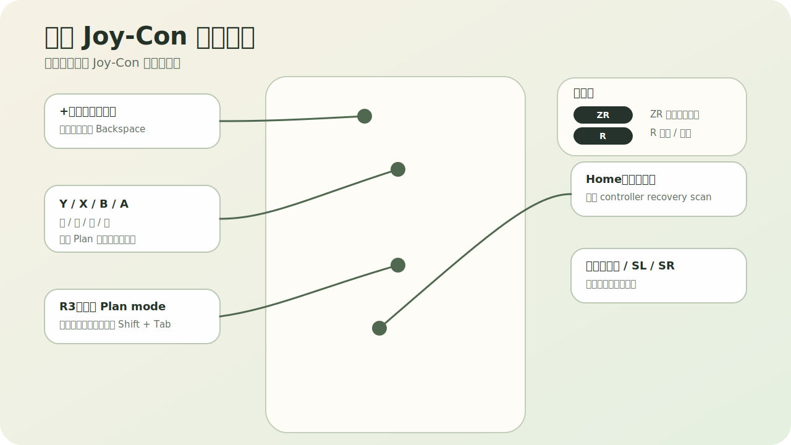
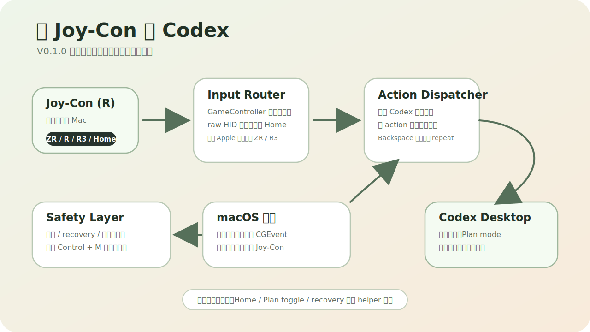
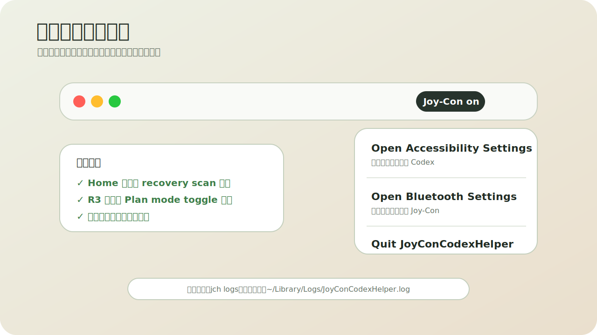

# JoyCon Codex Helper

把右手 Joy-Con 变成 Codex Desktop 的轻量语音与编辑控制器。

> 当前版本：`v0.1.0` 试玩版。项目专注于 macOS + Codex Desktop + 右手 `Joy-Con (R)` 的个人效率工作流，不隶属于 Nintendo、OpenAI 或 Apple。



## 它解决什么问题

`JoyCon Codex Helper` 是一个 macOS 菜单栏小工具，用 Joy-Con 控制 Codex Desktop 的常用输入动作：

- 按住 `ZR` 触发 Codex 的语音听写快捷键 `Control + M`，松开后停止。
- 使用 `X/B/Y/A` 做上、下、左、右选择或光标移动。
- 使用 `+` 删除左侧字符，支持长按连续删除。
- 使用 `R` 回车确认。
- 使用 `R3` 尝试切换 Plan mode。
- 使用 `Home` 触发一次控制器恢复扫描。
- 菜单栏展示 Joy-Con 连接与电量状态，低电量时发出提示音。



## 默认键位

| Joy-Con 按键 | 默认动作 |
| --- | --- |
| `ZR` 长按 | `Control + M`，用于 Codex 语音听写 |
| `X` / `B` | 上 / 下 |
| `Y` / `A` | 左 / 右 |
| `R` | `Return` |
| `+` | `Backspace`，支持长按连续删除 |
| `R3` | Plan mode toggle 尝试 |
| `Home` | controller recovery scan |
| 右摇杆方向 | 禁用 |
| `SL` / `SR` | 禁用 |

## 安装与运行

前置条件：

- macOS 14 或更新版本。
- Xcode Command Line Tools，确保 `swift` 可用。
- 右手 `Joy-Con (R)` 已通过蓝牙连接到 Mac。
- Codex Desktop 已安装并可打开。

从源码运行：

```bash
git clone https://github.com/cyjjjj-21/joycon-codex-helper.git
cd joycon-codex-helper
swift run JoyConCodexHelper
```

可选：安装短命令 `jch`：

```bash
mkdir -p ~/.local/bin
ln -sf "$(pwd)/bin/jch" ~/.local/bin/jch
jch
```

查看实时日志：

```bash
jch logs
```

## 第一次试用

1. 在 macOS 蓝牙设置中连接右手 `Joy-Con (R)`。
2. 启动 helper：`jch` 或 `swift run JoyConCodexHelper`。
3. 打开菜单栏里的 Joy-Con 状态项。
4. 如果按键没有进入 Codex，先点 `Open Accessibility Settings`，给 Terminal 或 helper 进程开启辅助功能权限。
5. 如果 Joy-Con 连接异常，点 `Open Bluetooth Settings` 检查蓝牙连接。
6. 回到 Codex，把焦点放进 composer 或 Plan 选项区域。
7. 按住 `ZR` 说话，松开停止听写。



## 菜单栏

菜单栏状态会显示连接和电量：

- `JC offline`：没有识别到控制器。
- `Joy-Con on`：已连接，但系统没有提供电量。
- `Joy-Con 75%`：已连接并读取到电量。
- `Joy-Con LOW 18%`：低电量提示。

菜单项：

- `Open Accessibility Settings`：打开辅助功能权限设置。
- `Open Bluetooth Settings`：打开蓝牙设置。
- `Quit JoyConCodexHelper`：退出 helper。

## 设计说明

macOS 的 `GameController` 框架在部分 Joy-Con 连接状态下不会暴露 `ZR`、`R`、`R3` 和 `Home`。本项目保留 `GameController` 处理方向键和普通按钮，同时为这些漏掉的按键增加 raw HID 路由。

按键注入通过 `CGEvent` 完成。长按组合键使用标准顺序：

```text
modifier down -> key down -> key up -> modifier up
```

helper 在控制器断连、恢复扫描和应用退出时会释放所有 held keys，避免 `Control + M` 或连续删除卡住。

## 配置

主要配置文件：

- `config/profiles/layout-v1-default.json`：物理按键到 action 的映射。
- `config/bindings/default-actions.json`：action 到键盘事件的映射。
- `config/runtime/input-aliases.json`：GameController 和 raw HID 的运行时 alias。
- `config/runtime/controller-preferences.json`：控制器选择、电量轮询和低电量阈值。
- `config/runtime/target-apps.json`：目标应用 bundle id。

改键位时优先改配置文件，不需要改底层路由代码。

## 已知边界

- 编辑键只校验 Codex 是否在前台，不做深度 composer 焦点检测。使用 `+`、`R` 或方向键前，请让输入框或 Plan 选项区域保持焦点。
- `R3` 当前依赖 Codex Desktop 的 `Shift + Tab` 行为来尝试切换 Plan mode；如果 Codex 后续改变快捷键，需要重新确认。
- `Home` 不是“从完全睡眠中唤醒 Joy-Con”的魔法按钮。它的作用是在 helper 已经能收到 Home 事件时触发一次 controller recovery scan。
- 本项目只针对右手 `Joy-Con (R)` 设计，左手 Joy-Con 或 Pro Controller 需要新增配置与测试。

## 开发

运行测试：

```bash
swift test
```

本地启动：

```bash
swift run JoyConCodexHelper
```

## 图片说明

README 中的键位图、工作流图和菜单栏图用于说明默认交互与菜单状态，不属于 helper 的运行时资源。素材来源与说明见 [docs/assets/ATTRIBUTION.md](docs/assets/ATTRIBUTION.md)。

## 许可

项目源代码采用 MIT License，见 [LICENSE](LICENSE)。外部图片素材及其派生图按对应素材授权执行。
